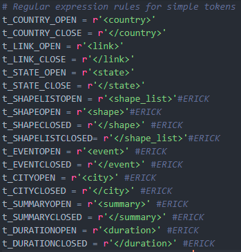
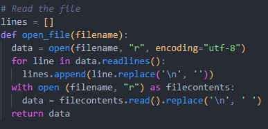
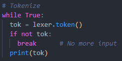

# Tarea Programada 1: Entregable 3

## **Problema a resolver**

Construir una aplicación que muestre información de avistamientos de OVNI'S, tomados desde un archivo de entrada tipo XML. En este archivo se muestran una lista de avistamientos divididos en evento, fecha, hora, descripción, país, entre otros datos. Para la resolución de este problema es necesario un analizador léxico y sintáctico que convierta este archivo en datos de entrada válidos para la aplicación a implementar.

## **Descripción del archivo XML base**

El archivo consta de tres partes divididas claramente:

1. Lista de estados: Consiste en una lista de los estados o lugares donde ha habido al menos un reporte de avistamiento de OVNI.

2. Lista de formas: Consiste en una lista de las formas de los OVNIS que han sido reportadas.

3. Lista de eventos: Es la lista más larga y compleja. Consiste en una lista de cada uno de los eventos (avistamientos) que han sido reportados. Se divide en diversos tipos de datos del reporte como lugar, hora, entre otros. Además, provee un link donde se puede ver la descripción completa del suceso.

> Cada una de las etiquetas que están en el archivo XML tienen una etiqueta de apertura **_<ejemplo\>_** y una etiqueta de cierre **_</ejemplo\>_**.

## **Descripción de la solución**

La solución consta de dos analizadores: uno léxico y otro sintáctico. El analizador léxico recibe como entrada el archivo XML y se encarga de leerlo línea por línea mientras va separándolo en tokens que ya fueron especificados en el programa, mediante expresiones regulares establecidas. Además, genera una salida la cual es la entrada del analizador sintáctico correspondiente. Este analizador sintáctico es el encargado de revisar cada uno de los tokens y darse cuenta de si cumplen o no las reglas que de igual forma se establecieron en el mismo programa. 

Esta solución se divide en 5 etapas, en las cuales se van agregando funcionalidades escaladamente. Para esta tercera etapa, se cuenta con archivo en código python, llamado ***lexical_analyzer.py*** en el que se cuenta con el siguiente formato y funcionalidades:

+ A) Formato:
  + Lista de tokens: Una lista de cada uno de los tokens que se van a desprender de las etiquetas y de los datos contenidos en el archivo XML. 

    

  + Expresiones regulares simples: Son aquellas expresiones regulares que no pasan de una línea de extensión, las cuales analizan cada una de las etiquetas del archivo XML.

    

  + Expresiones regulares complejas: Son expresiones regulares que tienen una densidad de análisis más amplia, usadas para extraer los datos contenidos en el interior de cada etiqueta de apertura y de cierre.

    

  + Lectura del archivo XML: Esta parte consta de una función para la apertura del archivo XML y su debida lectura línea por línea para su posterior análisis.

    

  + Separar y generar la salida: Se separa cada etiqueta y su contenido en los tokens respectivos y se crea un archivo de salida de texto con el respectivo contenido de cada uno de ellos.

    

+ B) Funcionalidad:

  Lo que el programa es capaz de realizar incluye la lectura del archivo XML, la separación de su contenido en los tokens correspondientes, la creación de un archivo de salida y en análisis de los tokens correspondientes.

  En el caso del análisis sintáctico, lo que el programa en este momento es capaz de hacer incluye el respectivo análisis de la estructura de los tokens, donde se van subdividiendo en partes más simples y triviales, en donde la solución de esa parte sea sencilla y rápida. En este análisis se pueden identificar dos casos:

  + Caso recursivo: Se da cuando una de las partes del código que se está analizando se llama recursivamente a sí mismo para seguir analizando sus partes. Un ejemplo sería el siguiente:  
    
    `stateslist_element : STATE_OPEN STATE STATE_CLOSE stateslist_element`  

    En este caso, el *stateslist_element* se llama recursivamente después de analizar el token de *STATE_CLOSE*, para verificar si hay más datos que analizar con una estructura similar a esa.

  + Caso no recursivo: Es el más simple de ambos, únicamente analiza la parte de código que le corresponde y finaliza esa parte de análisis porque terminó el mismo. Por ejemplo:          

    `time_element : TIME_OPEN TIME TIME_CLOSE`

    En este otro caso, al analizar las etiquetas correspondientes y leer el token *TIME_CLOSE*, finaliza el análisis de su parte.
## **Ejecución del programa**

Para poder ejecutar el programa y ver su salida, es necesario tener alguna versión de python instalada en el sistema operativo en el cual va a hacer la ejecución. Además, es necesario hacer la respectiva inclusión de la biblioteca _ply_ de python, la cual contiene los analizadores léxico (lexer) y sintáctico a utilizar.

Para la ejecución del programa, hay que ubicarse en la carpeta que contiene el archivo _.py_ y simplemente hay que escribir el siguiente comando:

`py lexical_analyzer.py`

O, su equivalente:

`python lexical_analyzer.py`

Cabe recalcar que para las pruebas del correcto funcionamiento del programa, existe un segundo archivo _.xml_ llamado ***UFO***, el cual tiene una parte pequeña del archivo de análisis original, esto con el fin de hacer más legible y entendible el análisis correspondiente. Además, el análisis de este archivo genera su respectivo archivo de salida llamado ***syntax.txt***
### **Archivo de salida**

Al efectuar la ejecución del programa detallada anteriormente, se va a generar un archivo de salida _.txt_ el cual va a mostrar una noción de cómo se está aplicando el análisis sintáctico de los tokens.