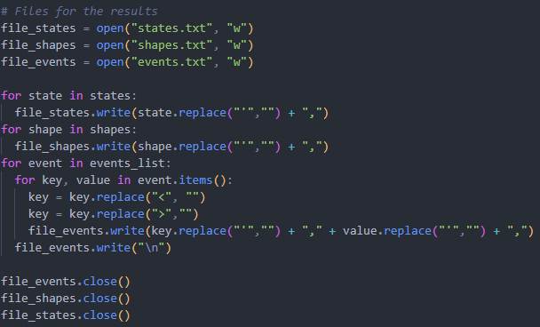
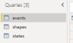

# Tarea Programada 1: Entregable 5

## **Problema a resolver**

Construir una aplicación que muestre información de avistamientos de OVNI'S, tomados desde un archivo de entrada tipo XML. En este archivo se muestran una lista de avistamientos divididos en evento, fecha, hora, descripción, país, entre otros datos. Para la resolución de este problema es necesario un analizador léxico y sintáctico que convierta este archivo en datos de entrada válidos para la aplicación a implementar.

## **Descripción del archivo XML base**

El archivo consta de tres partes divididas claramente:

1. Lista de estados: Consiste en una lista de los estados o lugares donde ha habido al menos un reporte de avistamiento de OVNI.

2. Lista de formas: Consiste en una lista de las formas de los OVNIS que han sido reportadas.

3. Lista de eventos: Es la lista más larga y compleja. Consiste en una lista de cada uno de los eventos (avistamientos) que han sido reportados. Se divide en diversos tipos de datos del reporte como lugar, hora, entre otros. Además, provee un link donde se puede ver la descripción completa del suceso.

Cada una de las etiquetas que están en el archivo XML tienen una etiqueta de apertura **_<ejemplo\>_** y una etiqueta de cierre **_</ejemplo\>_**.

## **Descripción de la solución**

La solución consta de dos analizadores: uno léxico y otro sintáctico. El analizador léxico recibe como entrada el archivo XML y se encarga de leerlo línea por línea mientras va separándolo en tokens que ya fueron especificados en el programa, mediante expresiones regulares establecidas. Además, genera una salida la cual es la entrada del analizador sintáctico correspondiente. Este analizador sintáctico es el encargado de revisar cada uno de los tokens y darse cuenta de si cumplen o no las reglas que de igual forma se establecieron en el mismo programa. 

Esta solución se divide en 5 etapas, en las cuales se van agregando funcionalidades escaladamente. Para esta quinta etapa, se cuenta con archivo en código python, llamado ***lexical_analyzer.py*** en el que se cuenta con el siguiente formato y funcionalidades:

+ A) Formato:

  + Lista de estados y sus abreviaciones: Una lista con cada estado que sale en el archivo y su respectiva abreviatura, para capturar ambos.

    

  + Lista de tokens: Una lista de cada uno de los tokens que se van a desprender de las etiquetas y de los datos contenidos en el archivo XML. 

    

  + Expresiones regulares simples: Son aquellas expresiones regulares que no pasan de una línea de extensión, las cuales analizan cada una de las etiquetas del archivo XML.

    

  + Expresiones regulares complejas: Son expresiones regulares que tienen una densidad de análisis más amplia, usadas para extraer los datos contenidos en el interior de cada etiqueta de apertura y de cierre.

    

  + Lectura del archivo XML: Esta parte consta de una función para la apertura del archivo XML y su debida lectura línea por línea para su posterior análisis.

    

  + Separar los tokens: En un ciclo, se separa cada etiqueta y su contenido en los tokens respectivos hasta que no haya más archivo que analizar.

    

  + Producciones: Son las reglas mediante las cuales el analizador sintáctico efectúa el respectivo análisis de los tokens y sus componentes.

    

  + Archivos de salida: Se generan tres _.txt_ con los estados, formas y eventos analizados con el programa. Estos mismos archivos son los que toma el _Power BI_ como entrada.

    

+ B) Funcionalidad:

  Lo que el programa es capaz de realizar incluye la lectura del archivo XML, la separación de su contenido en tokens, el análisis de éstos tokens, la creación de los tres archivos de salida y la generación de las listas y gráficos correspondientes.

  En el caso del análisis sintáctico, lo que el programa en este momento es capaz de hacer incluye el respectivo análisis de la estructura de los tokens, donde se van subdividiendo en partes más simples y triviales, en donde la solución de esa parte sea sencilla y rápida. En este análisis se pueden identificar dos casos:

  + Caso recursivo: Se da cuando una de las partes del código que se está analizando se llama recursivamente a sí mismo para seguir analizando sus partes. Un ejemplo sería el siguiente:  
    
    `stateslist_element : STATE_OPEN STATE STATE_CLOSE stateslist_element`  

    En este caso, el *stateslist_element* se llama recursivamente después de analizar el token de *STATE_CLOSE*, para verificar si hay más datos que analizar con una estructura similar a esa.

  + Caso no recursivo: Es el más simple de ambos, únicamente analiza la parte de código que le corresponde y finaliza esa parte de análisis porque terminó el mismo. Por ejemplo:          

    `time_element : TIME_OPEN TIME TIME_CLOSE`

    En este otro caso, al analizar las etiquetas correspondientes y leer el token *TIME_CLOSE*, finaliza el análisis de su parte.
  
  Una vez evaluado cada uno de los valores contenidos en el archivo _.xml_, se guarda el resultado de cada uno de los tokens en listas y listas de diccionarios. En el caso de *states_list* y *shape_list*, se usó una lista sencilla donde se guardaron todos los tokens de estados y formas posibles. Mientras tanto, en la lista de eventos se utilizó una lista de diccionarios, donde cada diccionario representa un evento del archivo _.xml_ con sus respectivas partes como _\<link>_, _\<date>_, _\<time>_, entre otros. 

  En la siguiente imagen se puede ver la declaración de las respectivas listas para guardar los estados, las formas y los eventos:

  

  Mientras tanto, en las siguientes imágenes se puede ver cómo se van guardando los respectivos tokens:

  + ***<states_list>***

   

   + ***<shape_list>***

   

   + ***Lista de eventos***

   

  Para los archivos de salida, solamente es necesario crear los tres archivos correspondientes y luego escribirles la información ya previamente guardada en las listas y diccionarios, como se puede ver en la siguiente imagen:

  

  A la hora de escribir en los archivos, se le hace un reemplazo de algunos caracteres como _', <, >_ para que la entrada para el Power BI esté limpia. 

  En el caso de Power BI, se le especifica el formato de cómo se va a mostrar la información y qué es lo que se va a mostrar específicamente, en este caso listas, gráficos y línea de tiempo. Por lo que lo único que necesita Power BI para mostrar la información, es que los archivos de salida que toma como entrada existan y que el formato mencionado anteriormente esté previamente definido.

## **Ejecución del programa**

Para poder ejecutar el programa y ver su salida, es necesario tener alguna versión de python instalada en el sistema operativo en el cual va a hacer la ejecución. Es necesario también hacer la respectiva inclusión de la biblioteca _ply_ de python, la cual contiene los analizadores léxico (lexer) y sintáctico a utilizar. Además de esto, para la salida gráfica del programa se necesita tener instalado _Power BI_ en el equipo donde va a ser ejecutado el programa (se puede descargar [aquí](https://www.microsoft.com/en-us/download/details.aspx?id=58494)), ya que es el encargado de generar las listas, gráficos y línea de tiempo de la información correspondiente.

Para la ejecución del programa, hay que ubicarse en la carpeta que contiene el archivo _.py_ y simplemente hay que escribir el siguiente comando:

`py lexical_analyzer.py`

O, su equivalente:

`python lexical_analyzer.py`

Cabe recalcar que para las pruebas del correcto funcionamiento del programa, existe un segundo archivo _.xml_ llamado ***UFO***, el cual tiene una parte pequeña del archivo de análisis original, esto con el fin de hacer más legible y entendible el análisis correspondiente.

En el caso de Power BI, se le tiene que definir la entrada para el archivo, para la cual hay que especificarle la ruta y cada archivo _.txt_ generado por el programa de python y asignarlo a cada parte que ya está especificada en el archivo de Power BI (Esto solo se tiene que hacer la primera vez).
Aquí se puede ver un paso a paso de esta especificación de la entrada para Power BI:

+ Primer paso_: En la columna de la derecha donde dice _Fields_, se le da click derecho donde dice _events_

  

+ Segundo paso: En el menú despegable que se muestra, hay que seleccionar la opción que dice _Edit query_

  

+ Tercer paso: En la parte izquierda de la pantalla, en la columna llamada _Queries_, se muestran los tres archivos que se están esperando, por lo que hay que ir uno por uno y efectuar los dos siguientes pasos:
  
  

  + Cuarto paso: En la columna derecha, llamada _Applied steps_, hay que seleccionar la opción que dice _Source_.
  
     

  + Quinto paso: En la ventada desplegada, se presiona el botón _browse_, el cual va a abrir el explorador de archivos para especificar el archivo a abrir para esa parte específica del archivo de Power BI.
  
     
    
  
  **Recordar que el cuarto y quinto paso se tienen que hacer para las tres partes: estados, formas y eventos.**  
  _Cabe recalcar también que las capturas fueron tomadas con Power BI en inglés, por lo que los nombres de las columnas y opciones puede variar._

### **Salida del programa**

+ Archivos de salida:

  Al efectuar la ejecución del programa detallada anteriormente, se van a generar tres archivos de salida, uno por cada parte del programa: estados, formas y eventos, cada uno conteniendo su parte correspondiente del análisis del archivo _xml_.

+ Gráficos para ver la información:

  Habiendo generado los archivos de salida _.txt_ correspondientes, estos mismos archivos son los que toma el Power BI como su entrada para graficar la información. Teniendo ya acceso a esta información, en Power BI se muestran:

  - La lista de todos los eventos analizados.
  - Gráfico de la cantidad de eventos por estado.
  - Gráfico de la cantidad de eventos por forma. 
  - Gráfico de la cantidad de eventos por país.
  - La línea de tiempo de avistamientos por año.
  - El total de eventos por día.
  - El total de eventos de cada forma.
  - Un mapa con los puntos donde han habido avistamientos.